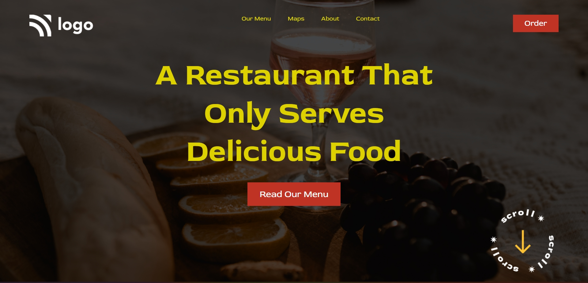

# Project-2

This project is a basic UI webpage which is created by using HTML and CSS. It's responsive.

## Authors

 >Manish Kumar

## What I learnt while creating this project

- Learnt about Media Queries
- Got to know about resizing the image
- Learnt flexbox 

## Honest Time to Finish Project

2 hours

# Netlify Link

[Project - 2](project-2-mk.netlify.app)

# Thumbnail

